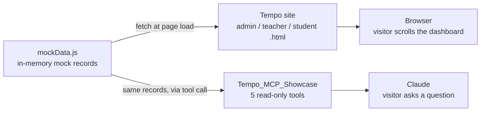

# Tempo — Mock Scheduling App

A minimal, front-end–only scheduling demo for an in‑home music teaching business. Built as a bootcamp final project to showcase an MVP with clean structure, mock data, and role‑based dashboards.

## Highlights
- Three dashboards: Admin, Teacher, Student — all populated from the Mock API
- Mock API (mockData.js) returning Promises (no backend)
- Shared role guard + logout via localStorage (`tempo-role`, see auth.js)
- Responsive layout with a mobile nav menu
- Zero build tools or deps (static files)

## Tech
- HTML, CSS, JavaScript (no framework)
- VS Code + Live Server (recommended)

## Project Structure
- index.html — landing
- login.html — sets a demo role
- admin.html — admin dashboard
- teacher.html — teacher dashboard
- student.html — student dashboard
- styles.css — site styles
- mockData.js — in‑memory “API” (stats, teachers, students, lessons)
- auth.js — shared role guard + logout helper
- site.js — shared page wiring (footer year, mobile nav, logout button)

## Quick Start
1) Open this folder in VS Code.
2) Right‑click index.html → “Open with Live Server” (or open index.html in a browser).
3) Use login.html to choose a role and navigate.

If you need to set a role manually:
- In DevTools console: `localStorage.setItem('tempo-role','admin')` (or `teacher`, `student`).

## Mock API
Example:
```js
MockAPI.getAdminStats().then(console.log);
MockAPI.getRecentBookings().then(items => console.log(items));
```
All data is static mock data for demonstration.

## AI Integration (MCP)
Tempo's dashboards aren't the only thing reading `mockData.js`. A companion MCP server
(`Tempo_MCP_Showcase`) exposes the same mock records as tools an AI assistant can call
directly — `list_teachers`, `list_students`, `search_students`, `get_teacher_availability`,
`get_calendar_events`. Same data, two front ends:



Ask Claude something like *"who's free Tuesday at 4pm?"* and it answers from the same mock
schedule the dashboards render — no separate backend involved.

## Roadmap (small, showcase‑friendly)
- Persist mock data to localStorage with basic CRUD
- Booking form and validation
- Export lessons to .ics (and optional Google Calendar add)
- Loading states while Mock API promises resolve

## Notes
This is a demo MVP for portfolio purposes; not intended for production use.